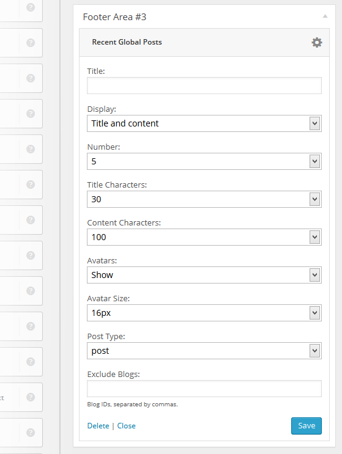
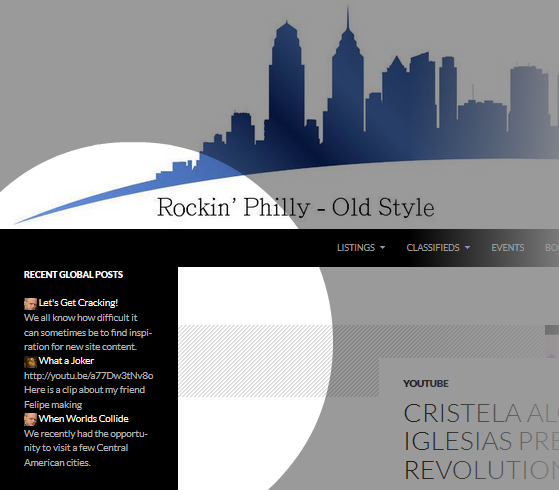

# Recent Global Posts Widget

  <a href="https://cp-psource.github.io/recent-global-posts-widget/" style="text-decoration: none; color: #0366d6; font-weight: bold;">Home</a>
  <a href="https://github.com/cp-psource/recent-global-posts-widget/releases" style="text-decoration: none; color: #0366d6; font-weight: bold;">Downloads</a>
  <a href="https://github.com/cp-psource/recent-global-posts-widget/wiki" style="text-decoration: none; color: #0366d6; font-weight: bold;">Docs</a>
  <a href="https://github.com/cp-psource/recent-global-posts-widget/discussions" style="text-decoration: none; color: #0366d6; font-weight: bold;">Support</a>
  <a href="https://github.com/cp-psource/recent-global-posts-widget/issues" style="text-decoration: none; color: #0366d6; font-weight: bold;">Bug Report</a>
  <a href="https://cp-psource.github.io/recent-global-posts-widget/psource.html" style="text-decoration: none; color: #0366d6; font-weight: bold;">PSOURCE</a>
  <a href="https://cp-psource.github.io/recent-global-posts-widget/readme-de.html" style="text-decoration: none; color: #0366d6; font-weight: bold;">DEUTSCH</a> 

## Recent Global Posts Widget shows all the latest posts from across your entire Multisite or BuddyPress network on your main site - simply, efficiently and quickly.

### Amazing [Post Indexer](https://cp-psource.github.io/ps-postindexer/ "Post Indexer") Extension

##### This simple powerful plugin allows you to:

*   Use a simple widget to display the **latest posts across your entire network**
*   Choice of displaying **title + content, title only or content only**
*   Option to change the **number of posts displayed**
*   Set **number of title and content characters allowed**
*   Option to **display avatars** and preset avatar size
*   Ability to **display custom post types**

### Familiar Settings

A Recent Global Posts Widget id added to** '**Widgets' in the dashboard of your main site. 

 Drag-n-drop to activate and simple configuration

 Drag the Recent Global Posts Widget into your sidebar, choose your configuration options and the latest posts from across your entire network will be pulled into your main site. 

 A powerful tool for discovering new content

 Recent Global Posts Widget adds a fun way for users to see and discover new content from across your entire network.

### To Install:

1\. Install the [Post Indexer](https://cp-psource.github.io/ps-postindexer/) 2.  Install the Recent Posts Plugin.

*   Once uploaded visit **Network Admin -> Plugins** to Network Activate the Recent Global Posts Widget Plugin.
*   Your Recent Global Post widget is added to **Appearance > Widgets** of your main site.
*   By default, the widget is available only on the main site of your network. This behavior can be changed by following the instructions below to edit your _wp-config.php_ file.
*   The Recent Global posts widget list public posts only.  Posts from privates sites aren't displayed.

3.  Install the [Avatars plugin](https://cp-psource.github.io/avatars/) (if you want to display avatars).

### To Use:

1.  Once installed you just go **Appearance > Widgets.** 2.  Add the Recent Global posts widget to your sidebar. 3\. Check out the configuration options below: 

 Once configured, it could look like this in your sidebar: 

### Enabling Widget for all sites

By default the Recent Global Posts widget is only enabled for use by the man site. You can enable it for all sites on your network as follows: 
1. Open up the ****wp-config.php**** in the root of your WordPress install 
2. Just before the line that says _That's all, stop editing!_, add the following:

define('RECENT_GLOBAL_POSTS_WIDGET_MAIN_BLOG_ONLY', false);

3\. Save and re-upload your amended wp-config.php file

  <a href="https://cp-psource.github.io/recent-global-posts-widget/" style="text-decoration: none; color: #0366d6; font-weight: bold;">Home</a>
  <a href="https://github.com/cp-psource/recent-global-posts-widget/releases" style="text-decoration: none; color: #0366d6; font-weight: bold;">Downloads</a>
  <a href="https://github.com/cp-psource/recent-global-posts-widget/wiki" style="text-decoration: none; color: #0366d6; font-weight: bold;">Docs</a>
  <a href="https://github.com/cp-psource/recent-global-posts-widget/discussions" style="text-decoration: none; color: #0366d6; font-weight: bold;">Support</a>
  <a href="https://github.com/cp-psource/recent-global-posts-widget/issues" style="text-decoration: none; color: #0366d6; font-weight: bold;">Bug Report</a>
  <a href="https://cp-psource.github.io/recent-global-posts-widget/psource.html" style="text-decoration: none; color: #0366d6; font-weight: bold;">PSOURCE</a>
  <a href="https://cp-psource.github.io/recent-global-posts-widget/readme-de.html" style="text-decoration: none; color: #0366d6; font-weight: bold;">DEUTSCH</a> 

 <a href="https://github.com/cp-psource">Copyright PSOURCE 2024</a>

